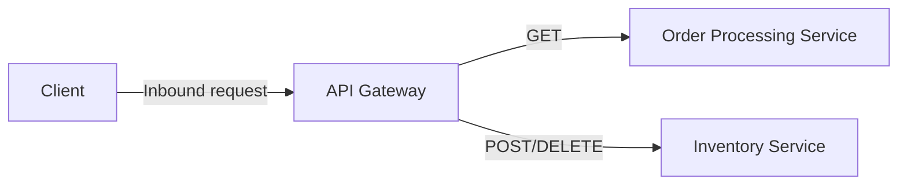

# 🚀 API Gateway –  Platform 🚀
---

## Diagram

---

## 🛰️ Control

**Gateway** routes API traffic between two sercvices:

* **Inventory Service** 🪐 `(${rewrite.backend.uri.primary})`
* **Order Processing Service** 🛸 `(${rewrite.backend.uri.secondary})`

Built with **Spring Cloud Gateway**, the router provides:

* Dynamic path rewriting
* HTTP method‑based routing
* Service isolation by endpoint type

---

## 🌟 Features

| Feature                  | Description                                                 |
| ------------------------ | ----------------------------------------------------------- |
| **Method‑Based Routing** | `GET` → Order Service  •  `POST`/`DELETE` → Inventory Service |
| **Path Rewriting Magic** | `/customer` → `/api/v1/customer` (similar for other resources) |
| **Dual Backend Support** | Seamlessly switch between two services             |
| **Actuator Monitoring**  | Inspect the gateway’s in real time             |

---

---

## 🔧 Actuator Tools

| Endpoint                                                                   | Description                                                | Method |
|----------------------------------------------------------------------------|------------------------------------------------------------| ------ |
| `http://localhost:8071/actuator/gateway`                                   | View information regarding gateway                         | `GET`  |
| `http://localhost:8071/actuator/gateway/routepredicates`                   | View information regarding predicates used for routing 🗺️ | `GET`  |
| `http://localhost:8071/actuator/gateway/routes`                            | View all routes                                            | `GET`  |
| `http://localhost:8071/actuator/gateway`                                   | View information regarding gateway                         | `GET`  |
| `http://localhost:8071/actuator/gateway/routes/${routeId}/combinedfilters` | View routes for specific /**routeId**/ with filters        | `GET`  |
| `http://localhost:8071/actuator/health`                                    | Gateway health check                                       | `GET`  |
| `http://localhost:8071/actuator/info`                                      | Service information                                        | `GET`  |

## 🔧 Tips & Insights
* Operation people hit: 8071 (example: actuator); customers hit: 8070.  The reason is Gateway code can’t accidentally interfere with monitoring, and monitoring can’t accidentally expose production APIs
* Actuator never touches Gateway filters, rewrites or CORS logic
---

